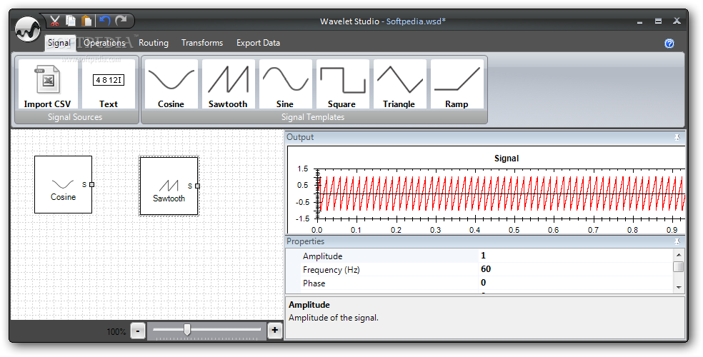
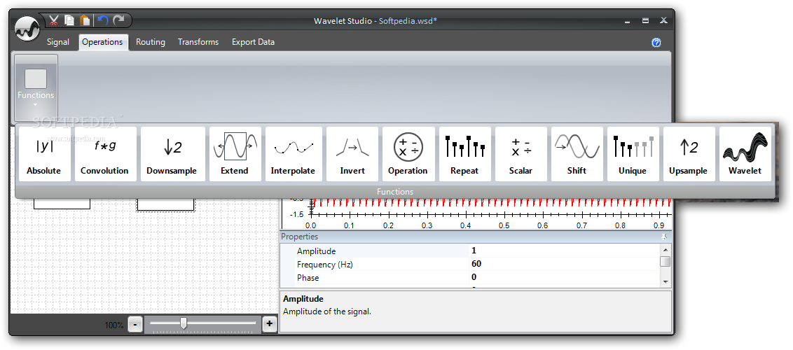
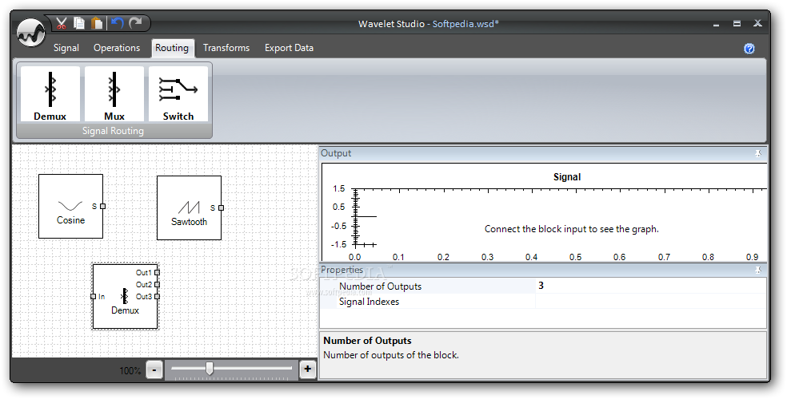
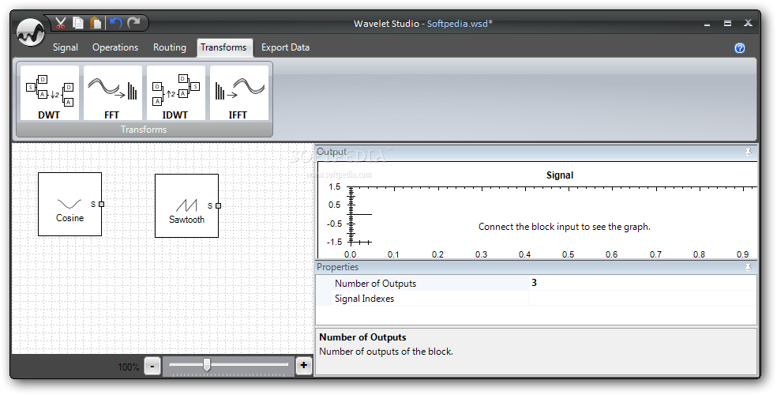
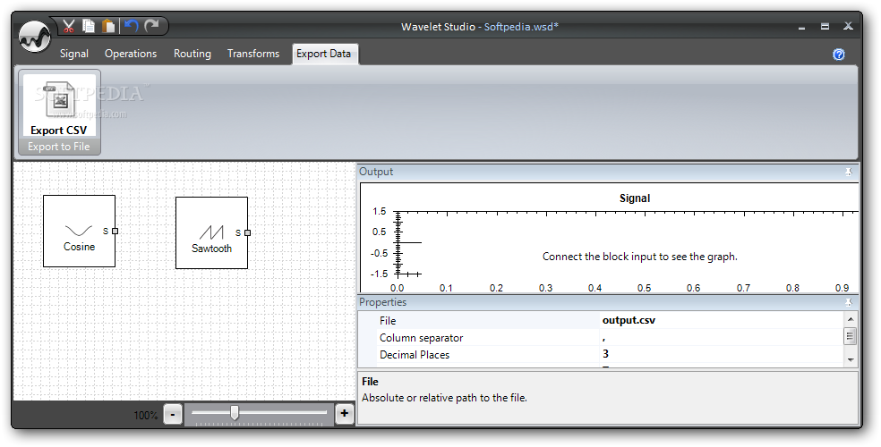
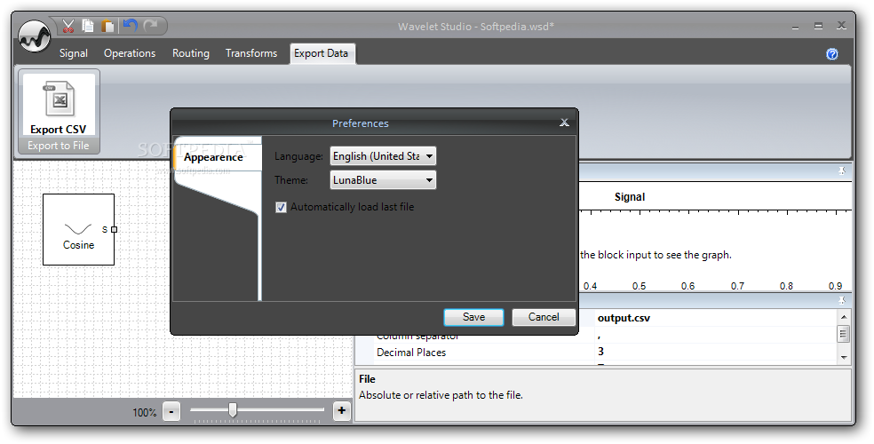
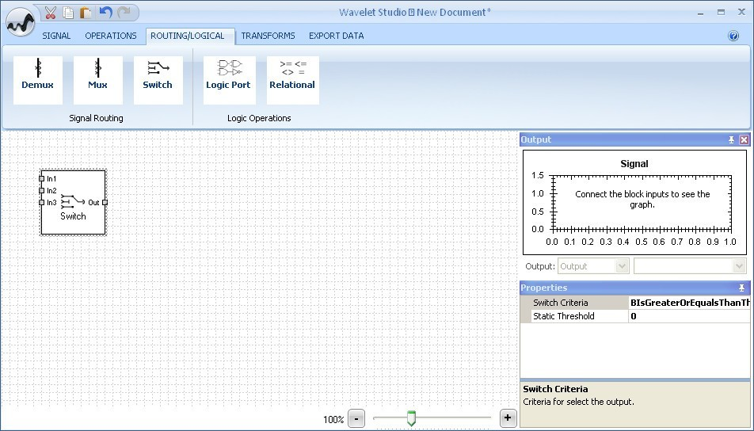

# Wavelet Studio
The Wavelet Studio project is a set of tools built in C# to assist the signal processing with Wavelet Analysis.
More information about the topic can be found in the vast literature available on the Internet. In particular I suggest the excellent [The Wavelet Tutorial](https://users.rowan.edu/~polikar/WTtutorial.html).

# Documentation
The documentation is now available [here](trunk/res/docs/documentation/BlockList.md)

# Main features
- Discrete Wavelet Transform (DWT)
- Inverse Discrete Wavelet Transform (IDWT)
- Support for most common discrete wavelet
  - Haar
  - Daubechies 2 to 10
  - Coiflets 1-5
  - DMeyer
  - Symlets 2-8
- Make and use your own mother wavelet function
- 8 Signal Extension methods:
  - SymmetricHalfPoint
  - SymmetricWholePoint
  - AntisymmetricHalfPoint
  - AntisymmetricWholePoint
  - PeriodicPadding
  - ZeroPadding
  - SmoothPadding0 (continuous)
  - SmoothPadding1
- Estimate location of disturbance based on the normal distribution
- Signal generation of Sine, Sawtooth, Square and Triangle waves
- Application to demonstrate the features
